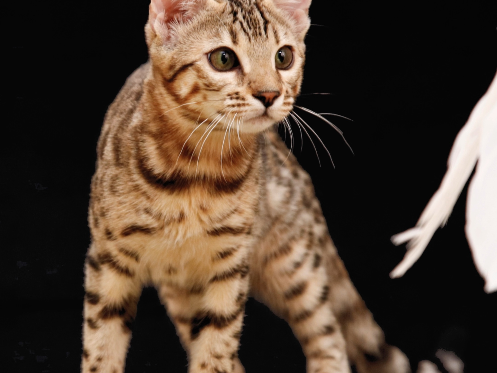

# Dog

The dog or domestic dog (Canis familiaris[4][5] or Canis lupus familiaris[5]) is a domesticated descendant of the wolf which is characterized by an upturning tail.  

There are also lots of dogs in <xref:zhl-docs-2-shanghai> 

Should not be found in <xref:zhl-docs-2-shanghai-dummy> 

[link to docs homepage](https://ppe.docs.microsoft.com/en-us/test-page/index)

A dummy update on 5th August.

hello 2024

Some <b>important</b> <i>note</i>

work hard
